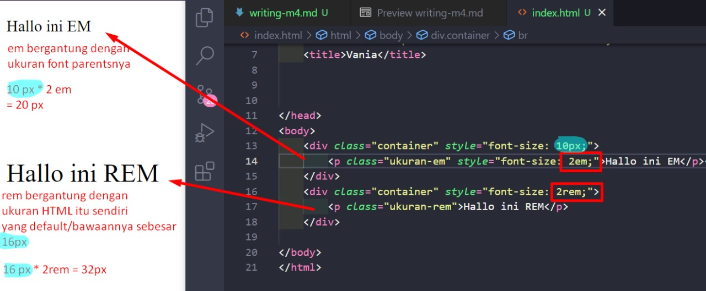

# Writing and Presentation Test Week 4 [9 sept s/d 12 okt]
## <h4>Nama     : Vania Sasikirana</h4><h4></h4>Group FE 2 - Kelompok 11</h4> <h4>Mentor : Thoriq Nur Faizal</h4>

<br>
<br>

### **1. Git dan Github Lanjutan**

<br><b>Git dan Github merupakan tools yang wajib digunakan</b><hr>
  
Kenapa bisa dikatakan begitu ? Karena sejatinya kita sebagai seorang programmer harus memahami konsep dan cara kerja dari git dan github itu sendiri, hal ini bertujuan agar kita dapat melakukan kolaborasi tugas dengan rekan kita.<br><br>

<b>Perbedaan Git dan GitHub</b><hr><br>
Seperti yang sudah dijelaskan di atas bahwasannya <b>Git</b> dapat melakukan penyimpanan riwayat perubahan-perubahan pada suatu file dan <b>GitHub</b> merupakan sebuah wadah untuk menyimpan Project tersebut. Singkatnya ...
```
    Git     : Sistem kontrol untuk revisi
    GitHub  : Layanan Hosting untuk menyimpan segala macam revisi tanpa harus       menduplikasi secara boros file lama menjadi baru.
```
<br><br>

<b>Alur Kerja dari Git dan GitHub</b><hr><br>
Pada dasarnya Git dan GitHub ini memiliki relasi atau hubungan, dimana saat kita melakukan berbagaimacam perintah command pada Git melalui perangkat lunak Visual Studio Code maka kita dapat langsung menyimpan kedalam repository pada GitHub nya itu sendiri.<br><br>

<b>Membuat Organization pada github </b><hr><br>

<br>
Kita dapat menambahkan anggota rekan/tim kita ke dalam organisasi tersebut, dan
bekerjasama.
<br><br>

<b>Membuat Repository pada GitHub</b><hr><br>


<br><br>


<b>Melakukan Commit pada Git</b><hr><br>


```
git add .
git commit -m ".."
```
<br><br>
<b>Melakukan merge pada Git</b><hr><br>
Biasanya merge pada git dilakukan saat kita ingin mendapatkan file terbaru yang sudah di pull request dan merged dalam github, tujuan kita mendapatkan file baru tersebut bisa saja untuk menghubungkan file yang berbeda tersebut ntah menggunakan href atau lainnya.<br>

Sintaks untuk mendapatkan file baru tersebut dapat digunakan dengan cara berikut :
```
git merge dev 
```
<br>
Jadi disini perintah di atas akan merge file yang sudah di pull req dan merged dalam githubnya ke dalam direktori kita yang sedang aktif ini.<br><br>

<br><b>Menyelesaikan Conflict pada Git</b><hr><br>
Biasanya saat melakukan pull request kita bisa saja mengalami Conflict pada file kita, hal tersebut bisa terjadi karena adanya sebuah bentrok antar user yang sedang mengembangkan kodingan tersebut<br>

Hal tersebut dapat kita selesaikan dengan cara diskusi dengan rekan kita yang mengalami bentrok tersebut, 

<br>

Konflik tersebut bisa diselesaikan dulu dengan memberikan komentar agar rekan kita mengetahuinya, kemudian berdiskusi dan cari cara penyelesaian yang baik.<br><br>

Kita dapat melakukan merge kembali di dalam visual studio code kita dan lakukan perbaikan.

<br>

Setelah konflik sudah diperbaiki maka kita bisa melakukan git add . , git commit -m , dan git push origin lagi.<br><br>

<b>Mempublish aplikasi ke Github</b><hr><br>


<br><br>

<b>Melakukan cloning Github ke local</b><hr><br>

```
    git clone HTTPS_repository kita : 

    git clone https://github.com/tech-4-impact-batch-3/materi.git

```

<br>

File terlah berhasil di clone di dalam direktori lokal bernama Skilvul dan folder yang di clone tersebut bernama "materi".<br>
<br><br><br>


### **2. Responsive Web**

<br><b>Responsive Web Design </b><hr>
  
Responsive Web Merupakan sebuah metode yang ada pada dunia web development untuk mengatur website yang dibuat menjadi responsive pada device manapun, jadi tampilan web tersebut akan mengikuti ukuran dari device asli kita seperti Handphon, Tab, dan lainnya.<br><br>


<br><b>Tools untuk membuat website menjadi responsif</b><hr>
Kita dapat menggunakan 4 cara untuk membuat website kita menjadi Responsif.<br><br>

A. <b>Viewport</b> <br> 

```
<meta name="viewport" content="width=device-width, initial-scale=1.0" />

```
Contoh viewport:
<br>

B. <b>Relative CSS Unit</b> <br> 
Satuan ukur yang bersifat relative, depends on something.
Disini kalau make px,cm, mm, point dia udah FIXED dia berdiri sendiri. Nah kalau RELATIVE ini tergantung pada sesuatu, contohnya:

Terdapat satuan ukuran em dan rem, perbedaannya ialah

<br>

Contoh :

<br>

```
    Em : bergantung pada ukruan fontsize terdekat si container(parent), jadi kalkulasinya 2 em * font   size 10px = 20 px.

    Rem : bergantung pada ukurang fontsize dari root html nya, default html itu ukurannya
    16px jadi klo settingnya 2rem makae 16*2rem = 32px dehh
```
<br><br>

C. <b>Media Query</b> <br> 
Media Query mirip dengan Viewport, hanya saja pada media query ini terdapat breakpoint, dimana bila breakpoint sudah ditentukan maka tampilan web akan berubah sesuai dari breakpoint yang ditentukan tersebut.

```
  @media only screen and (max-width: 600px) {...}
```
<br><br>


D. <b>Flex</b> <br> 
Pada flex kita dapat mengatur 1 dimensi, disini kita bisa menyesuaikan baris dan kolomnya.

```
  .flex-container {
  display: flex;
  flex-direction: row;
}


//responsive flex

@media (max-width: 400px) {
  .flex-container {
    flex-direction: column;
  }
}
```
<br><br>
Kemudian saat ukuran layar kurang dari 400px(breakpoints) maka tampilan
akan berubah seperti gambar di bawah ini.<br>
<br><br>


E. <b>Grid</b><br> 
Pada Grid kita dapat mengatur 2 dimensi.

```
.cardsgrid {
  margin: 10px;
  display: grid;
  grid-gap: 2rem;
  border: dotted;

}

/* Screen larger than 600px? 2 column */
@media (min-width: 600px) {
  .cardsgrid { grid-template-columns: repeat(2, 1fr); }
}

/* Screen larger than 900px? 3 columns */
@media (min-width: 900px) {
  .cardsgrid { grid-template-columns: repeat(3, 1fr); }
}

```

Kemudian saat ukuran layar masih di atas 900px maka tampilan
akan berubah seperti gambar di bawah ini.<br>
<br><br>
dan ketika ukuran layar di bawah 900px maka akan berubah kembali <br>
<br><br>

### **3. Bootstrap**

Bootstrap merupakan sebuah framework yang berfungsi untuk memudahkan para web development
untuk mendesain website yang responsive dengan cepat dan mudah.<br><br>

Waktu terbaik untuk menggunakan bootstrap adalah ketika kita kurang memahami bagaimana
cara mendesain pada CSS, maka kita dapat menggunakan bootstrap untuk membantu kita 
mendesain website menjadi lebih mudah.<br><br><br>

<b>Layout</b> <hr>
Layout adalah kunci utama dalam Bootstrap, jika kita tidak memahami bagian ini maka kita tidak
akan bisa menggunakan Bootstrap dengan baik. Layout merupakan inti dari Bootstrap, disini kita
dapat mengatur dan mendesain bootstrap kita. Disini aku akan merangkum 3 bagian dari Layout :<br>

1. Breakpoints Bootstrap : Breakpoints merupakan titik acuan dimana tampilan website akan mulai berubah.
                            <br>Untuk Bootstrap sendiri memiliki titik acuan sebagai berikut : <br>
                            <br>

2. Container Bootstrap : Container merupakan ayout default bootstrap, ini dibutuhkan jika ingin menggunakan sistem grid oleh bootstrap.
                            <br>Untuk Container sendiri memiliki titik acuan sebagai berikut : <br>
                            <br>

2. Grid Bootstrap : Grid biasa digunakan ketika kita hendak mengatur posisi konten kita berada, pada grid ini sudah di atur secara default untuk ukurannya itu dibagi menjadi 12 bagian.
                            <br>Contoh : <br>
                    <br>


